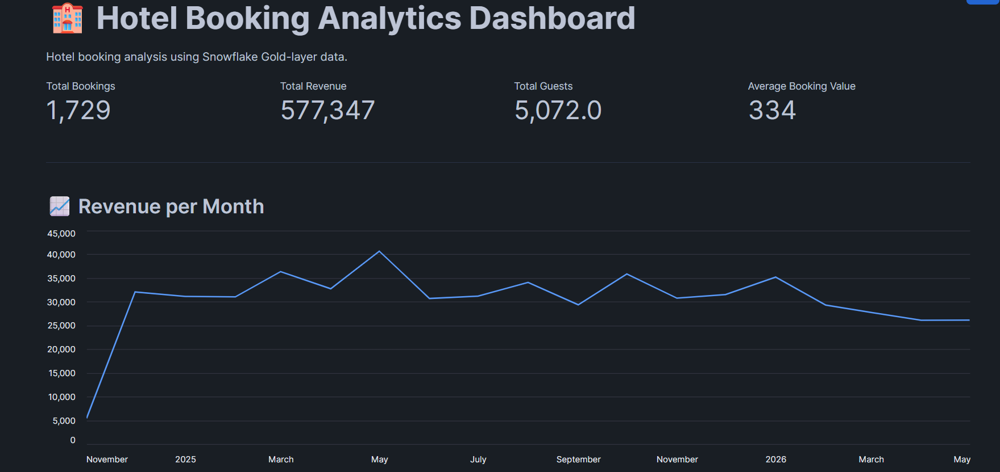
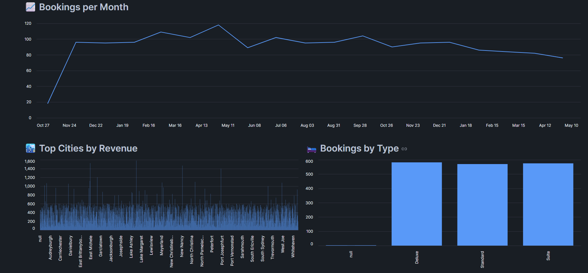
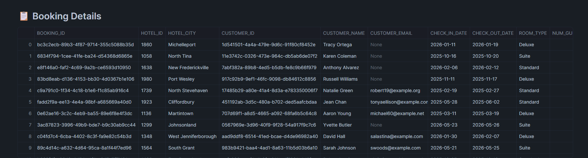

# Hotel Booking Analysis using Snowflake

This project is about analyzing hotel booking data using Snowflake and creating an interactive dashboard using Streamlit.

## Tools Used

- Snowflake
- SQL
- Python
- Streamlit
- Pandas
- Plotly

## Project Flow

Raw CSV → Stage → Bronze → Silver → Gold → Streamlit Dashboard

### Bronze Layer
Raw data is loaded from the stage into:

`BRONZE_HOTEL_BOOKING`

### Silver Layer
The data is studied, cleaned and transformed into:

`SILVER_HOTEL_BOOKING`

### Gold Layer
Business-ready data is created for the dashboard:

- `GOLD_BOOKING_CLEAN`
- `GOLD_AGG_DAILY_BOOKING`
- `GOLD_AGG_HOTEL_CITY`
- `GOLD_AGG_MONTHLY_BOOKING`

## Dashboard

The **HOTEL BOOKING ANALYTICS DASHBOARD** is created using Streamlit.

It helps analyze:

- Total bookings and revenue
- Daily and monthly booking trends
- Revenue by hotel city
- Bookings by room type
- Booking status

### Dashboard Screenshots

## Project Files

- `HOTEL_BOOKINGS.sql` — Snowflake database, Bronze, Silver and Gold layer SQL
- `HOTEL_BOOKING_DASHBOARD.py` — Streamlit dashboard
- `requirements.txt` — Required Python libraries
- `hotel_bookings_raw.csv` — Raw dataset

## Live Dashboard

[Open HOTEL BOOKING ANALYTICS DASHBOARD](https://app.snowflake.com/streamlit/tnmizih/rmc79360/#/apps/3gxgfxrig4k2qmb37k5y)

## Conclusion

This project helped me understand how to build a Bronze-Silver-Gold data pipeline in Snowflake and use the Gold layer data to create a Streamlit dashboard based on the business objectives.
